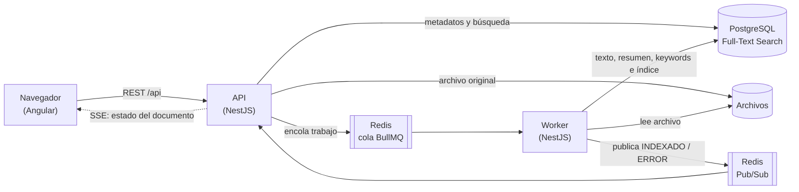

# Arquitectura

## 1. Diagrama

**Flujo:**

1. La API valida el archivo, lo guarda, registra el documento en `PROCESANDO`, encola el trabajo y responde `202` con el ID.
2. El worker extrae el texto, genera resumen y palabras clave, y construye el índice de búsqueda.
3. El worker publica el nuevo estado en Redis; la API lo reenvía al navegador por SSE.

API y worker comparten código pero corren como procesos separados, por lo que escalan de forma independiente.

## 2. Decisiones técnicas

| Componente | Elección | Motivo |
|---|---|---|
| Backend | NestJS | Módulos, inyección de dependencias y soporte nativo para colas y SSE |
| Frontend | Angular | Componentes standalone y signals; comparte TypeScript con el backend (`packages/shared`) |
| Base de datos y búsqueda | PostgreSQL Full-Text Search | Índice invertido nativo, sin servicios adicionales y con consultas relacionales |
| Procesamiento | Redis + BullMQ | Reintentos, concurrencia y trabajos idempotentes |
| Tiempo real | SSE + Redis Pub/Sub | Ver sección 3 |

### Motor de búsqueda (sin `LIKE`)

- Columna `tsvector` con índice **GIN** (índice invertido palabra → documentos).
- Pesos por campo: título (A) > etiquetas, categoría y autor (B) > resumen y keywords (C) > contenido (D).
- Una sola consulta: `websearch_to_tsquery` (soporta `"frase"`, `-excluir`, `OR`), filtros por categoría y etiquetas con `JOIN`/`EXISTS`, ranking con `ts_rank_cd`, total con `COUNT(*) OVER()` y paginación.
- El resaltado (`ts_headline`) se calcula solo para los resultados de la página actual, por ser la operación más costosa.
- La búsqueda está detrás de la interfaz `SearchEngine`: migrar a Elasticsearch solo requiere una nueva implementación.

Se descartó Elasticsearch porque, para este volumen, agrega un servicio que operar y sincronizar sin una mejora de latencia significativa.

### Tiempos de respuesta

Medido con 10.000 documentos y 200 búsquedas HTTP:

| Escenario | p50 | p95 |
|---|---|---|
| Datos normales | 37 ms | 119 ms |
| Peor caso (término presente en ~98 % de los documentos) | 595 ms | 634 ms |

`EXPLAIN ANALYZE` confirma el uso del índice GIN (~2 ms en base de datos). El rango de 400 ms – 1 s se cumple como tope incluso en el peor caso.

## 3. Tiempo real

**SSE** en lugar de WebSocket: la comunicación es solo del servidor al cliente, funciona sobre HTTP estándar y el navegador se reconecta automáticamente.

- El worker publica los cambios de estado en el canal Redis `documents:status`.
- Cada instancia de la API está suscrita al canal y los reenvía por `GET /api/events/documents`. Funciona con varias instancias.
- Heartbeat cada 25 s para evitar cierres por inactividad en proxies.
- En Angular, un servicio único mantiene la conexión y actualiza el estado con signals.
- Al reconectarse, el frontend recarga el listado para recuperar eventos perdidos.
- Si un documento se indexa antes de que llegue la respuesta del upload, el servicio conserva los últimos eventos y los aplica al recibirla.

## 4. Escalabilidad

1. **Horizontal, sin cambios de código:** la API no guarda estado y puede tener varias réplicas detrás de un balanceador; los workers escalan según la cola (`docker compose up --scale worker=3`). Los archivos pueden pasar a S3 o Azure Blob, ya que en base de datos solo se guarda una ruta relativa.
2. **PostgreSQL:** réplicas de lectura para búsquedas, particionamiento de la tabla de documentos, paginación por cursor, conteo estimado en búsquedas masivas y caché de búsquedas frecuentes en Redis.
3. **Motor dedicado:** con decenas de millones de documentos, o si se requiere búsqueda tolerante a errores, sinónimos o multilenguaje, se migra a Elasticsearch/OpenSearch. PostgreSQL sigue como fuente de verdad.

## 5. Organización del código

**Monolito modular** (documentos, procesamiento, búsqueda, notificaciones, health). Una arquitectura hexagonal completa o microservicios serían sobre-ingeniería para este alcance; las abstracciones se usan solo donde hay un cambio probable:

| Patrón | Uso |
|---|---|
| Strategy | Extractores de texto por formato (PDF, TXT/MD); nuevos formatos sin modificar el worker |
| Puerto / adaptador | `SearchEngine` → PostgreSQL |
| Observer / Pub-Sub | Desacopla el worker de las conexiones SSE |
| Separación lectura/escritura | Un servicio para cargas y otro para consultas |

**Errores y validación:** `class-validator` en las entradas, filtro global con formato de error uniforme, y validación de archivos por extensión, tamaño y firma binaria (PDF). Configuración por variables de entorno (`.env`).

## 6. Concurrencia

| Riesgo | Solución |
|---|---|
| Mismo archivo subido dos veces (incluso en paralelo) | Hash SHA-256 con restricción `UNIQUE` → `409` |
| Categorías o etiquetas creadas en paralelo | `INSERT ... ON CONFLICT` atómico |
| Trabajos duplicados en la cola | ID del trabajo = ID del documento |
| Dos workers con el mismo documento | `UPDATE ... WHERE status = 'PROCESANDO'`; solo uno lo aplica |
| Fallos temporales | 3 reintentos con backoff exponencial |
| Fallos permanentes (PDF dañado, sin texto) | Pasa directo a `ERROR` |
| Redis caído al encolar | Documento en `ERROR` y respuesta `503` |

## 7. Disponibilidad

- `GET /api/health` verifica PostgreSQL y Redis; se usa como healthcheck en Docker.
- Contenedores con reinicio automático; las migraciones corren antes de la API y el worker.
- Redis con persistencia AOF: la cola sobrevive a reinicios.
- Apagado ordenado de API y worker.
- En producción: PostgreSQL y Redis gestionados con réplicas y respaldos.

## 8. Mejoras futuras

- Patrón Outbox para encolado transaccional.
- OCR para PDF escaneados.
- Detección de idioma (hoy el índice usa español).
- Autenticación, límites de carga y observabilidad (OpenTelemetry).
